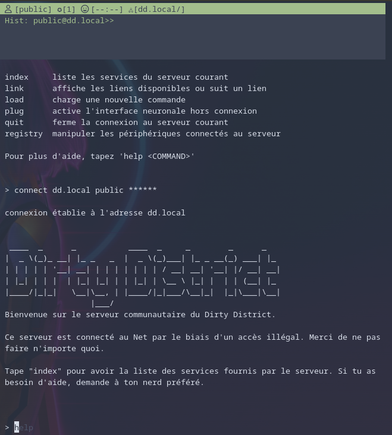

Le **Net** est une série de tubes reliant de nombreuses machines à travers le monde. Une fois connecté au réseau, il suffit d'entrer la bonne adresse pour vous connecter à n'importe quelle machine, n'importe où.

Chaque machine fournit un certain nombre de services - c'est pour ça qu'on les appelles des **Serveurs**. Une fois connecté à un serveur depuis votre **Console**, vous pouvez utiliser des **Commandes** pour interagir avec le serveur. Les services fournis (ou pas) par un serveur sont les suivants :

- des **liens** pour aller vers d'autres serveurs (commande `link`)
- des **données** dans lesquelles fouiller (commande `data`)
- des **registres** pour activer/désactiver des périphériques connectés au serveur (commande `registry`)

# L'interface

Voici à quoi ça ressemble (sauf retouches de dernière minute, mais l'idée est là)

Au sommet se trouve la **barre de statut**. Elle affiche les informations suivantes :

- l'identifiant avec lequel vous êtes connecté
- le niveau de privilège associé à votre identifiant
- le compte à rebours avant déconnexion si vous avez déclenché une alerte en faisant quelque chose d'illégal
- le chemin suivi jusqu'au serveur courant

Au bas de la fenêtre se trouve **l'invite de commande**. Quand vous tapez une commande, elle apparait ici.

Le milieu de la fenêtre est la **sortie de commande**. C'est ici que s'affiche le résultat de la dernière commande exécutée. Si la sortie est trop longue, les flèches haut/bas permettent de faire défiler le texte.

# Les commandes

Voici une liste des commandes, par thème.

## L'aide (commande `help`)

Si vous voulez savoir quelles sont les commandes disponibles, ou comment s'utilise une commande spécifique, tapez `help` pour afficher l'aide, et lisez bien ce qui est écrit.

## Navigation

La base de l'utilisation du Net, c'est de naviguer d'un serveur à un autre. Les commandes les plus courantes sont les suivantes :

- `connect` permet de se connecter directement à un serveur, pour peu qu'on connaisse son adresse et qu'on dispose d'un identifiant et d'un mot de passe valides. A noter que beaucoup de serveurs sont accessibles publiquement, avec l'identifiant/mot de passe public/public.
- `link` permet de suivre un lien fourni par le serveur dans lequel vous vous trouvez actuellement - ce qui permet parfois de se connecter sans nécessairement disposer d'un identifiant valide.
- `back` permet de revenir au serveur précédent.
- `index` permet d'afficher des informations sur le contenu du serveur courant - pratique pour se faire une idée de ce qu'on peut y trouver.
- `identify` vous permet de vous identifier sur le serveur courant, si vous connaissez un identifiant valide mais que vous êtes arrivés via un lien ou avec l'identifiant public. Etre identifié permet généralement d'avoir accès à certains services inaccessibles aux utilisateurs de base.
- `quit` permet de fermer proprement la connexion au serveur courant.

## Interaction

En plus des liens, les serveurs fournissent des données et des registres.

La commande `data` permet d'effectuer des recherches par mot clef (`data search`), et d'afficher le contenu d'une donnée (`data view`). A noter que vous ne pouvez pas afficher la liste de toutes les données du serveur - il faut donc avoir une petite idée de ce qu'on recherche. De même, toutes les données ne sont pas nécessairement accessibles à tous (niveau de privilège requis).

La commande `registry` permet d'interagir avec les périphériques connectés au serveur. Vous pouvez lister les registres (`registry search`) ou les modifier (`registry edit`). A noter que tous les registres ne sont pas accessibles à tous (niveau de privilège requis).

## Sécurité

Tous les serveurs du Net disposent de système de sécurité pour éviter que n'importe qui fasse n'importe quoi. La sécurité sur le Net se décline en trois aspects :

- Les identifiants/mots de passe permettent de restreindre l'accès aux seuls utilisateurs disposant d'un identifiant valide.
- Chaque identifiant possède un **niveau de privilège** qui lui permet d'accéder à certains services et pas d'autres.
- En cas d'intrusion, le **scan de sécurité** finit toujours par mettre la main sur l'intrus pour le déconnecter.

## Hacking

Le hacking c'est l'art d'imposer sa volonté à la machine, de lui faire faire des choses pour lesquelles elle n'a pas été conçue. Dans la pratique, ça consister beaucoup à aller là où on n'est pas censé aller. Pour commetre leurs méfaits, les hackers ont quelques outils à leur disposition.

**L'interface Neuronale Directe** permet au hacker de se brancher directement à sa console, et d'agir beaucoup plus vite sur le réseau - très pratique quand on vient de déclencher une alerte et que ce n'est qu'une question de minutes avant que le scan de sécurité vous mette à la porte. Pour pouvoir l'utiliser, il faut en avoir une (implant cyber) et l'activer avec la commande `plug`. Le désavantage de cette interface, c'est que si vous vous faites déconnecter de force par la sécurité, vous vous prenez des dégats.

**Les commandes de hacking** permettent de faire des actions illégales. Ces commandes représentent des outils mais aussi des talents propres aux personnages. Toutes les commandes ne sont pas accessibles à tous.

- `rise` permet d'augmenter le niveau de privilège sur un serveur 
- `jack` permet de suivre un lien pour lequel on n'a pas le niveau de privilège requis
- `evade` permet de retarder la déconnexion forcée du scan de sécurité (`evade`)

Pour plus d'infos, utilisez la commande `help` !
